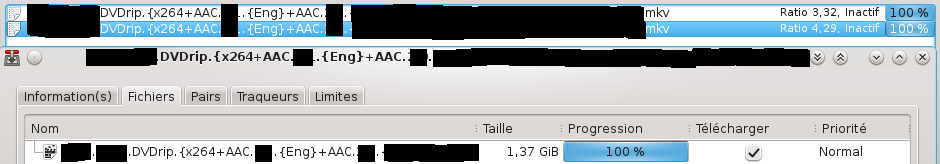
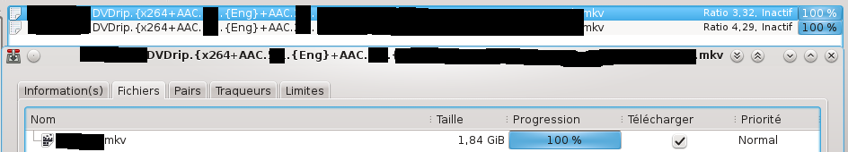

The aim of this project is to try a repair of *resume files* that could be corrupted.
In this case you will have to re-download your torrent file and you will loose all
your local stats (download time, seed time, data uploaded or downloaded, ratio).

This program can edit and repair those files. So, your stats will be saved and
you will not have to redownload your torrent files nor verify downloaded data.

Moreoever, like transmission-edit tool for announce replacement, transmission-check
can edit/replace the directory where files are downloaded.

# Use case

## Typical problem encountered

* Corrupted torrents

    

* 1 entry is legitimate,

    

* the other is corrupted

    

## How to

    Usage: transmission-check [options] resume-file

    Options:
    -h --help                     Display this help page and exit
    -m --make-changes             Make changes on resume file
    -r --replace      <old> <new> Search and replace a substring in the filepath
    -v --verbose                  Display informations about resume file
    -V --version                  Show version number and exit

* Check inconcistencies

    transmission-check -v resume-file

* Replace substring in path

    transmission-check -r old-substring new-substring resume-file

* Apply all changes

    # Stop transmission daemon
    sudo service transmission-daemon stop

    transmission-check -m resume-file
    transmission-check -m -r old-substring new-substring resume-file

    # Save your new resume files
    sudo cp /var/lib/transmission/info/resume/* /var/lib/transmission/info/resume.bak/

    # Start transmission daemon
    sudo service transmission-daemon start

    # Here you will have to stop server, copy the resume files that you saved before,
    # then restart the server.
    # Don't know why, but it works...
    sudo service transmission-daemon stop
    sudo cp /var/lib/transmission/info/resume.bak/* /var/lib/transmission/info/resume/
    sudo service transmission-daemon start

    # Here we are. Torrents & stats are ok.

# Sources

## Get and compile libtransmission sources

Get sources from packages and uncompress them:

    apt-get source transmission-common
    tar xvf transmission_2.84.orig.tar.xz

Configure & make:

    cd transmission-2.84/
    ./configure --disable-cli --disable-daemon
    # Dont'use this option or it will stop shortly : --disable-utp
    make

Install dependencies:

    sudo apt-get install libcurl4-openssl-dev libevent-dev libevent-extra-2.0-5 intltool

If you plan to use the lib inside a project, you will have to install also:

    sudo apt-get install libminiupnpc-dev

Full (but useless here) Build_dep list (`apt-get build-dep transmission-common`):

    dh-autoreconf dh-systemd libatk-bridge2.0-dev libatspi2.0-dev libcurl4-gnutls-dev libdbus-1-dev libdbus-glib-1-dev libevent-dev libevent-extra-2.0-5 libgtk-3-dev libminiupnpc-dev libnatpmp-dev libnotify-dev
    libqt5clucene5 libqt5concurrent5 libqt5designer5 libqt5designercomponents5 libqt5help5 libqt5opengl5 libqt5qml5 libqt5quick5 libqt5quickwidgets5 libqt5sql5 libqt5webkit5 libqt5xml5 libsystemd-daemon-dev
    libsystemd-dev libwayland-dev libxkbcommon-dev libxtst-dev qt5-default qt5-qmake qtbase5-dev qtbase5-dev-tools qttools5-dev-tools x11proto-record-dev

## Compilation of transmission-check

Get sources from git:

    git clone

Copy libtransmission headers and lib to `include` folder:

    cp ./transmission-2.84/libtransmission/*.h /transmission-check/include/libtransmission/
    cp ./transmission-2.84/libtransmission/*.a /transmission-check/include/libtransmission/

Copy third-party library headers and lib to `include` folder:

    cp -R ./transmission-2.84/third-party/* /transmission-check/include/

Compile:

    make

# Documentation

## Code

See libtransmission code:

resume.c (*.resume file handling)
https://github.com/wereHamster/transmission/blob/master/libtransmission/resume.c

variant.c (*.resume, *.torrent files handling)
https://github.com/wereHamster/transmission/blob/master/libtransmission/variant.c

## Resume full file description

This chapter is a copy of transmission's wiki (see the link below).

Transmission keeps working information on each torrent in a "resume" file. This file is stored in the 'resume' directory.

Filename: torrent_file_name . hash?.resume

The file contains the following per-torrent properties:

    Property            Description
    activity-date       Date we last uploaded/downloaded a piece of data
    added-date          Date torrent was added
    corrupt             total number of corrupt bytes downloaded
    done-date           Date torrent finished downloading
    destination         Download directory
    dnd Do not          download file integer list (one item per file in torrent) 0=download, 1=dnd
    downloaded          Total non-corrupt bytes downloaded
    incomplete-dir      Location of incomplete torrent files
    max-peers           Maximum number of connected peers
    paused              true if torrent is paused
    peers2              IPv4 peers
    peers2-6            IPv6 peers
    priority            list of file download priorities (one item per file in torrent),
                        each value is -1 (low), 0 (std), +1 (high)
    bandwidth-priority
    progress
    speed-limit
    speed-limit-up      Torrent upload speed limit
    speed-limit-down    Torrent download speed limit
    ratio-limit         Torrent file limit
    uploaded
    speed
    use-global-speed-limit
    use-speed-limit
    down-speed
    down-mode
    up-speed
    up-mode
    ratio-mode
    mtimes
    bitfield

    Constants
    Maximum number of remembered peers  MAX_REMEMBERED_PEERS    200

Source: [transmission wiki](https://trac.transmissionbt.com/wiki/ResumeFile).
